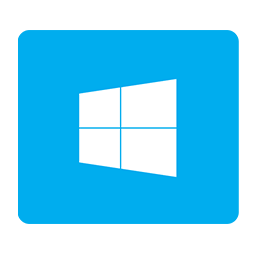
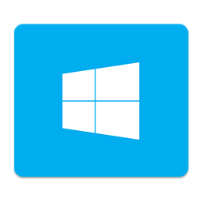

# Microsoft Remote Desktop Replacement Icon

My main work machine is a Mac, however I also own a media station that runs on Windows 10. In order to access another computer, Microsoft offers the [Remote Desktop](https://itunes.apple.com/ca/app/microsoft-remote-desktop/id715768417?mt=12) application.

However, its icon doesn't look so good:

Instead, I used Windows 10's logo, which is quite slick, and built icons (one flat, one with a shadow) that would replace the one above:

Note: This design fits well with Yosemite's icons, as the shape of the icon is the same as the Finder's and other system applications (Terminal, System Prefs, etc.) If you use another Mac OS, see if this design fits as well.

## Installation

1. Check out the project or download the `bin` directory.
2. Locate the Microsoft Remote Desktop application in your Applications folder.
3. Get the information from the application:
    - Right-click on the icon and select "Get Info" from the contextual menu;
    - Or ⌘+I while the application icon is highlighted.
4. Drag the desired icon from the project's `bin` directory into the icon displayed in the information window.

Done! You updated your icon! Now, keep in mind that every time the application is updated, this icon customization is removed.